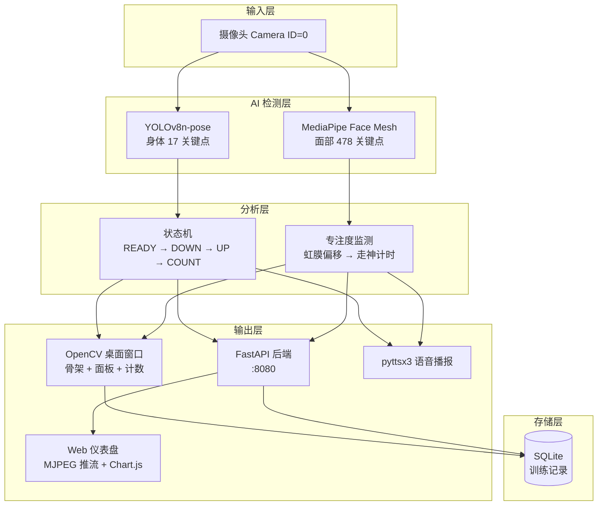

# Pose Fitness — 智能运动计数 + 专注度监测

基于计算机视觉的实时运动计数与专注度分析系统。支持深蹲、俯卧撑、引体向上、平板支撑四种动作的自动计数，同时通过虹膜追踪检测用户是否走神，提供 OpenCV 桌面窗口和 Web 仪表盘两种交互方式。

## 系统架构



## 功能特性

### 运动计数（4 种动作）

| 动作 | 检测原理 | 目标 |
|------|---------|------|
| 深蹲 | 膝关节角度（髋-膝-踝 < 90°） | 15 次 |
| 俯卧撑 | 肘关节角度（肩-肘-腕 < 90°）+ 身体水平线 | 15 次 |
| 引体向上 | 手腕与肩部相对位置 | 10 次 |
| 平板支撑 | 计时模式 + 髋部塌陷检测 | 60 秒 |

- 4 帧防抖状态机，避免误计数
- 实时姿势纠正提示（膝盖过脚尖、身体塌腰、摆动过大等）

### 专注度检测

- MediaPipe Face Mesh 提取 478 个面部关键点
- 虹膜位置追踪 → 计算视线水平偏移比
- 连续 3 秒视线偏离屏幕中心 → 语音提醒
- 实时专注度百分比显示

### Web 仪表盘

- MJPEG 实时视频推流
- 专注度趋势折线图（Chart.js）
- 7 天训练历史柱状图
- 响应式左右分栏布局

## 项目结构

```
project/
├── run.py                          # 启动入口
├── pose_fitness/
│   ├── config.py                   # 全局配置 / 关键点索引 / 虹膜索引 / 共享帧
│   ├── pose_detector.py            # YOLOv8 姿态检测封装
│   ├── face_detector.py            # MediaPipe Face Mesh + 虹膜追踪 + 视线方向
│   ├── focus_monitor.py            # 走神检测状态机
│   ├── exercises/
│   │   ├── base.py                 # 动作基类 + READY→DOWN→UP 状态机
│   │   ├── squat.py                # 深蹲
│   │   ├── pushup.py               # 俯卧撑
│   │   ├── pullup.py               # 引体向上
│   │   └── plank.py                # 平板支撑（计时模式）
│   ├── voice.py                    # pyttsx3 异步语音播报
│   ├── database.py                 # SQLite 训练记录存取
│   ├── ui.py                       # OpenCV 界面渲染（骨架 + 面板）
│   ├── api.py                      # FastAPI 后端 + MJPEG 推流 + 前端 HTML
│   └── main.py                     # 主循环（姿态 + 面部并行检测 + Web 线程）
└── requirements.txt
```

## 状态机设计

```
   ┌──────────┐
   │ WAITING  │ ← 关键点丢失 / 姿势不正确
   └────┬─────┘
        │ is_ready() 持续 4 帧
   ┌────▼─────┐
   │  READY   │ ← 起始姿势（如站直、手臂伸直）
   └────┬─────┘
        │ is_down() 持续 4 帧
   ┌────▼─────┐
   │   DOWN   │ ← 动作最低点（如蹲下、肘弯曲）
   └────┬─────┘
        │ is_up() 持续 4 帧
   ┌────▼─────┐
   │    UP    │ → count += 1，语音播报
   └────┬─────┘
        │ 自动跳转
   ┌────▼─────┐
   │  READY   │ ← 准备下一次
   └──────────┘
```

## 快速开始

### 环境要求

- Python 3.10+
- 摄像头（内置或 USB）

### 安装

```bash
# 克隆仓库
git clone <repo-url>
cd project

# 创建虚拟环境
python -m venv .venv
source .venv/bin/activate  # Windows: .venv\Scripts\activate

# 安装依赖
pip install -r pose_fitness/requirements.txt
```

### 运行

```bash
python run.py
```

首次运行会自动下载 YOLOv8n-pose 模型（约 6.5MB）。

### 操作说明

| 按键 | 功能 |
|------|------|
| `1` | 深蹲 |
| `2` | 俯卧撑 |
| `3` | 引体向上 |
| `4` | 平板支撑 |
| `r` | 重置计数 |
| `ESC` / `q` | 退出 |

切换动作或退出时，训练记录自动保存到 `fitness.db`。

### Web 仪表盘

启动后浏览器打开 `http://localhost:8080`：

- 左侧：实时摄像头画面
- 右侧：当前状态、专注度趋势图、训练历史柱状图

## 技术栈

| 层级 | 技术 | 用途 |
|------|------|------|
| 姿态检测 | YOLOv8n-pose (ultralytics) | 17 个身体关键点提取 |
| 面部检测 | MediaPipe Face Mesh | 478 个面部关键点 + 虹膜追踪 |
| 视觉处理 | OpenCV | 摄像头 IO / 画面渲染 |
| 语音 | pyttsx3 | 离线 TTS 播报 |
| 存储 | SQLite | 训练记录持久化 |
| Web 后端 | FastAPI + uvicorn | REST API + MJPEG 推流 |
| Web 前端 | 原生 HTML/JS + Chart.js | 仪表盘 + 图表 |

## 许可

MIT License
