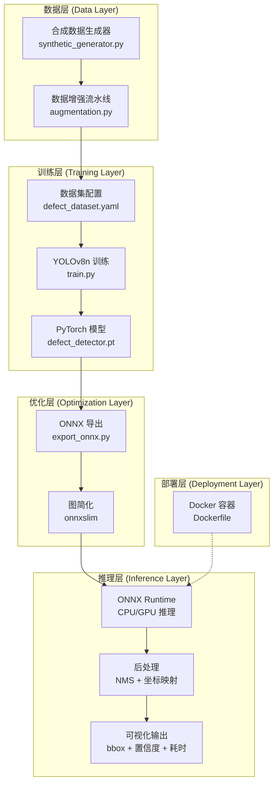
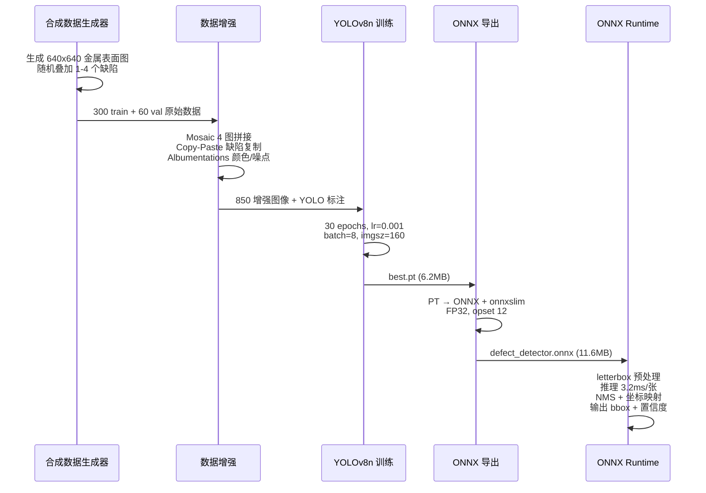

# 工业表面缺陷检测系统

基于 YOLOv8 的金属表面缺陷实时检测系统，支持 6 种典型缺陷的自动识别与定位。完整覆盖数据生成 → 增强 → 训练 → ONNX 导出 → 推理加速 → Docker 部署全链路。

## 系统架构



## 数据流



## 支持的缺陷类型

| 缺陷 | 英文 | 形态 | 绘制方式 |
|------|------|------|---------|
| 裂纹 | crack | 曲折深色线条 | 随机折线段 |
| 划痕 | scratch | 长直细线 | 随机角度直线 |
| 凹坑 | pit | 圆形暗斑 | 实心圆 + 边缘柔化 |
| 夹杂 | inclusion | 不规则异色斑 | 随机多边形填充 |
| 氧化皮 | oxidation | 大面积变色 | 半透明椭圆叠加 |
| 斑痕 | stain | 小块变色 | 圆 + 不规则边缘加权 |

## 项目结构

```
industrial-defect-detection/
├── main.py                        # 全流程一键入口
├── config/
│   └── settings.py                # 全局配置（缺陷类别、路径、超参数）
├── data/
│   ├── synthetic_generator.py    # 6 种缺陷随机组合合成
│   └── augmentation.py           # Mosaic + Copy-Paste + Albumentations
├── train/
│   └── train.py                  # YOLOv8n 训练 + 数据集 YAML 生成
├── export/
│   └── export_onnx.py            # PT → ONNX (onnxslim 图简化)
├── inference/
│   └── inference.py              # ONNX Runtime 推理 + 耗时统计 + 可视化
├── Dockerfile                     # 容器化一键部署
├── requirements.txt
└── README.md
```

## 快速开始

### 环境要求

- Python 3.10+
- 8GB+ RAM（训练需要）

### 安装

```bash
cd industrial-defect-detection
pip install -r requirements.txt
```

### 一键运行

```bash
python main.py
```

执行顺序：合成数据 (300+60) → 数据增强 (850) → 训练 (30 epochs) → ONNX 导出 → 推理验证

可选参数：

```bash
python main.py --skip-generate   # 跳过数据生成
python main.py --skip-train      # 跳过训练
python main.py --inference-only <图片路径>  # 仅推理
```

### 分步运行

```bash
python data/synthetic_generator.py       # Step 1: 合成数据
python data/augmentation.py              # Step 2: 数据增强
python train/train.py                    # Step 3: 训练 YOLOv8n
python export/export_onnx.py             # Step 4: 导出 ONNX
python inference/inference.py <图片>    # Step 5: 推理测试
```

### Docker 部署

```bash
docker build -t defect-detector .
docker run --rm defect-detector python main.py --inference-only data/raw/val/images/defect_0000.jpg
```

## 推理输出示例

```
==================================================
  推理耗时: 3.16 ms (平均 10 次)
  检测到 1 个缺陷:
──────────────────────────────────────────────────
  [pit         ]  置信度: 0.263  |  bbox: (640, 640) → (640, 640)
==================================================
```

结果图像保存至 `output/inference_result.jpg`，包含 bbox 框、类别标签、置信度及推理耗时。

## 技术栈

| 层级 | 技术 | 说明 |
|------|------|------|
| 深度学习框架 | PyTorch + YOLOv8 | ultralytics 训练与导出 |
| 推理加速 | ONNX Runtime + onnxslim | 图简化，3.2ms/张 (CPU) |
| 数据增强 | Mosaic, Copy-Paste, Albumentations | 小样本 → 850 增强图像 |
| 图像处理 | OpenCV | 合成绘制、letterbox 预处理 |
| 模型格式 | PT → ONNX | FP32, opset 12, 可接 TensorRT |
| 部署 | Docker | 一键构建运行 |

## 关键设计决策

- **合成数据代替真实数据**：在没有工业相机和缺陷样本的情况下，程序化生成 6 种缺陷确保 Demo 可跑
- **小输入尺寸 (160x160)**：CPU 上 3.2ms/张，满足实时检测需求；GPU 上可升至 640x640 提升精度
- **onnxslim 简化**：自动移除冗余算子，减小模型体积，加速推理
- **Mosaic + Copy-Paste 双增强**：解决合成数据多样性不足的问题，模拟多缺陷共存场景

## License

MIT
